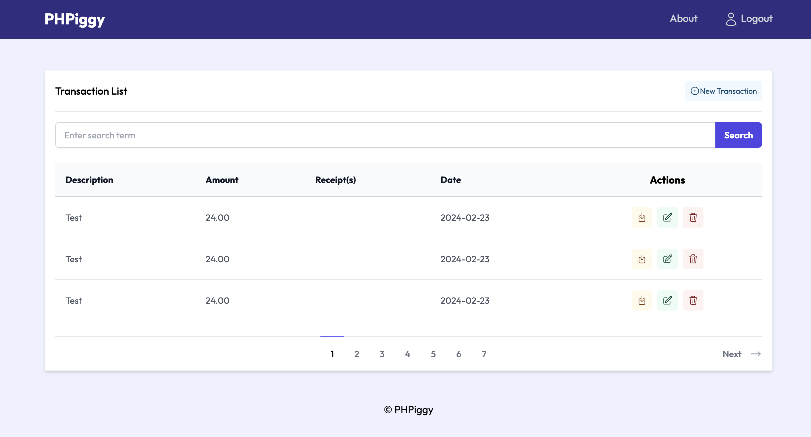

# PHP IGGY

>  A PHP application for tracking expenses.



## Usage

### Requirements

- PHP 8.1 or higher
- MySQL 5.7 or higher

### Installation

1. Clone the repo into your document root (www, htdocs, etc)
2. Create a database called `phpiggy`
3. Import the `database.sql` file into your database
4. Rename `.env.example` to `.env` and update with your credentials
5. Run `composer install` to set up the autoloading
6. Set your document root to the `public` directory

### Setting the Document Root

You will need to set your document root to the `public` directory. Here are some instructions for setting the document root for some popular local development tools:

##### PHP built-in server

If you are using the PHP built-in server, you can run the following command from the project root:

`php -S localhost:8000 -t public`

## Project Structure and Notes

#### Custom Laravel-like router

Creating a route in `routes.php` looks like this:

`$router->get('/lisings', 'ListingController@index');`

This would load the `index` method in the `App/controllers/ListingController.php` file.

#### Authorization Middleware

`$router->get('/register', 'AuthController@register)->middleware(AuthRequiredMiddleware::class)`

#### Public Directory

This project has a public directory that contains all of the assets like CSS, JS and images. This is where the `index.php` file is located, which is the entry point for the application.

You will need to set your document root to the `public` directory.

#### Framework Directory

All of the core files for this project are in the `Framework` directory. This includes the following files:

- **Database.php** - Database connection and query method (PDO)
- **Router.php** - Router logic
- **Session.php** - Session logic
- **Validator.php** - Simple validations for strings, email and matching passwords

#### PSR-4 Autoloading

This project uses PSR-4 autoloading. All of the classes are loaded in the `composer.json` file:

```json
 "autoload": {
    "psr-4": {
      "Framework\\": "Framework/",
      "App\\": "App/"
    }
  }
```

#### Namespaces

This project uses namespaces for all of the classes. Here are the namespaces used:

- **Framework** - All of the core framework classes
- **App\Controllers** - All of the controllers

#### App Directory

The `App` directory contains all of the main application files like controllers, views, etc. Here is the directory structure:

- **controllers/** - Contains all of the controllers including listings, users, home and error
- **views/** - Contains all of the views
- **views/partials/** - Contains all of the partial views

#### Other Files

- **/index.php** - Entry point for the application
- **public/.htaccess** - Handles the URL rewriting
- **/functions.php** - Contains helper functions
- **/Routes.php** - Contains all of the routes
- **composer.json** - Contains the composer dependencies
